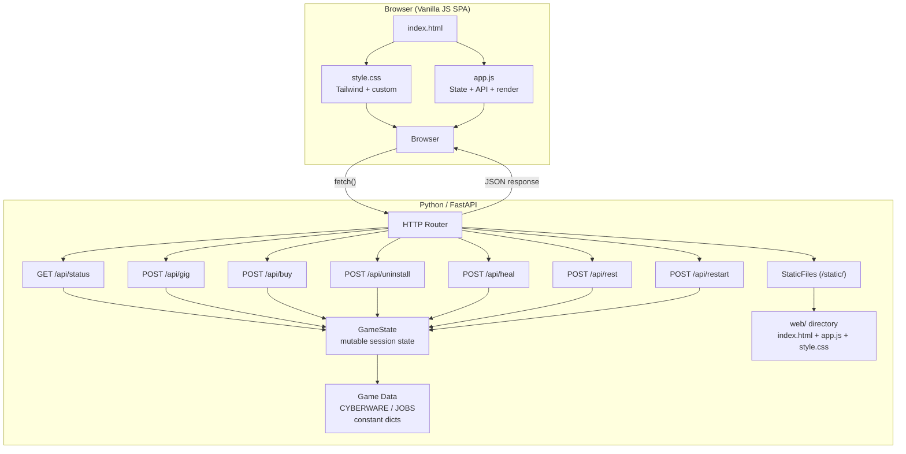

# Cyberpunk: Edge-Runner Simulator

A cyberpunk-themed single-player RPG, ported from a terminal text adventure to a web-based single-page application (SPA).

> *Live fast. Modify everything. Don't lose yourself.*

## Overview

Play as an edge-runner in Night City (year 2089). Take gigs from the fixer, buy and install cyberware upgrades, manage your humanity and health — and watch out: lose it all and the chrome takes over.

### Key Mechanics

| Stat | Description |
|---|---|
| **HP** | Health points (100 max). Gig failures deal 5–15 damage. Flatline at 0 → game over. |
| **Humanity** | Soul meter (100% max). Every purchase and gig costs humanity. Hit 0 → game over (cyberpsycho). |
| **Eddies ($)** | Money. Earned from successful gigs, spent on cyberware, healing, and rest. |
| **Combat Bonus** | Aggregate bonus from installed cyberware. Improves gig success chance. |
| **Day** | In-game day counter, incremented by gigs and rest. |

### Gigs

Eight gigs ranging from low-risk courier runs to extreme cyberpsycho hunts. Success chance = `clamp(15, 90, 50 + bonus*2 - difficulty//2)`. Failure costs money, humanity, and HP.

### Cyberware

Six installable upgrades, each with a price, combat bonus, and humanity cost. Uninstall any installed piece for a 50% refund.

### Recovery

| Action | Cost | Effect |
|---|---|---|
| **Safehouse Rest** | $150 | +5–12% humanity (HP not restored) |
| **Trauma Team Heal** | $500 | Full HP restore + 10–20% humanity |

## Architecture



### Tech Stack

| Layer | Technology |
|---|---|
| Backend | Python 3.9+, FastAPI, Uvicorn |
| Frontend | Vanilla JS (ES6+), Tailwind CSS (CDN) |
| Style | Cyberpunk dark theme, glassmorphism, neon accents |
| Data Transfer | JSON over HTTP (REST) |

## Installation

### Prerequisites

- Python 3.9 or later

### Setup

```bash
# Create and activate a virtual environment
python3 -m venv .venv
source .venv/bin/activate

# Install dependencies
pip install -r requirements.txt

# Start the server
python -m server.main
```

### Access

Open http://localhost:8000 in your browser.

## API Reference

### Endpoints

| Method | Path | Request Body | Description |
|---|---|---|---|
| `GET` | `/` | — | Serve the SPA |
| `GET` | `/api/status` | — | Get current player state |
| `POST` | `/api/gig` | `{"id": "data_heist"}` | Execute a gig |
| `POST` | `/api/buy` | `{"id": "optic_zoom"}` | Buy cyberware |
| `POST` | `/api/uninstall` | `{"id": "optic_zoom"}` | Uninstall / sell cyberware (50% refund) |
| `POST` | `/api/heal` | `{}` | Trauma Team emergency extraction ($500) |
| `POST` | `/api/rest` | `{}` | Safehouse rest ($150) |
| `POST` | `/api/restart` | `{}` | Reset to new game |

### Response Format

All endpoints return JSON with a consistent envelope:

```json
{
  "success": true,
  "message": "Installed Optical Zoom Implants for $800. Combat bonus +5. Humanity -4%.",
  "state": {
    "money": 200,
    "hp": 100,
    "humanity": 96.0,
    "combat_bonus": 5,
    "owned": [{"id": "optic_zoom", "name": "Optical Zoom Implants"}],
    "day": 1,
    "game_over": false,
    "humanity_color": "#00ff88"
  },
  "job_result": { ... }
}
```

For gigs, `job_result` contains: `success`, `job_name`, `roll`, `effective_diff`, `success_chance`, `risk_level`, plus either `reward` (on success) or `loss`/`hp_cost` (on failure).

## License

MIT
